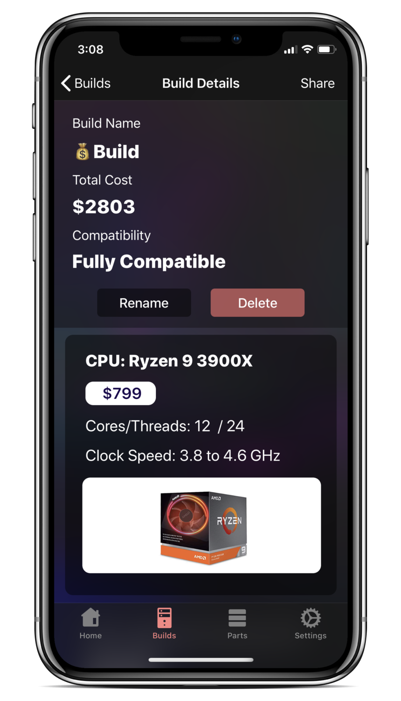

# BuildCores

BuildCores captures the essence of the desktop PC's flexibility through mix and matching endless combinations of PC components. It is designed for enthusiasts, scientists, professionals, or just anyone interested in the art of PC building.

  
  
  

## Download

    
      

BuildCores is [available in the Apple App Store](https://apps.apple.com/us/app/buildcores-mobile-pc-building/id1441971434) for both iPhones and iPads. 

BuildCores is also [available on the Google Play Store](https://play.google.com/store/apps/details?id=com.buildcores.buildcores_flutter) for Android devices.

## Support

If you have any issues or requests, please let me know by submitting an issue!

[Create a new issue](https://github.com/HarshdeepKahlon/BuildCores-Public/issues), and I'll try to quickly respond!

You can also email me at harshdeepkahlon00@gmail.com

## Thank You

Thanks to everyone who has used the app, reported bugs, gave feedback, rated the app, and suggested new features!
